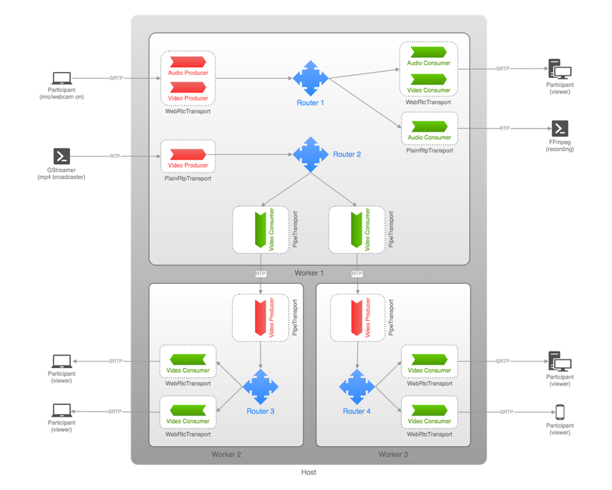
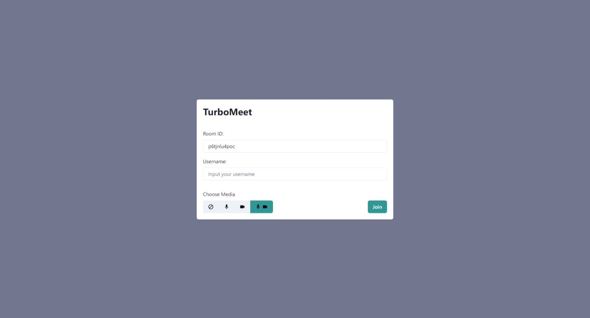
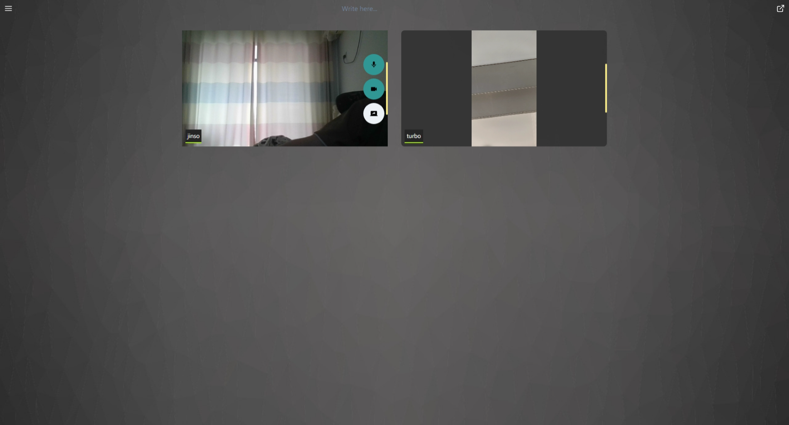
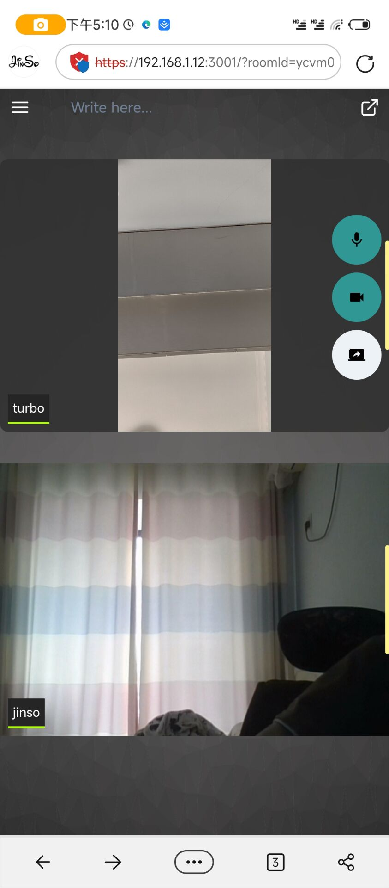
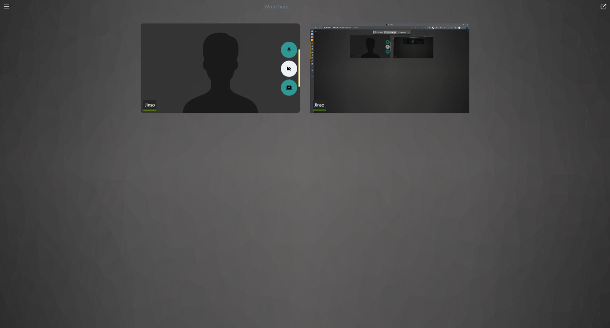
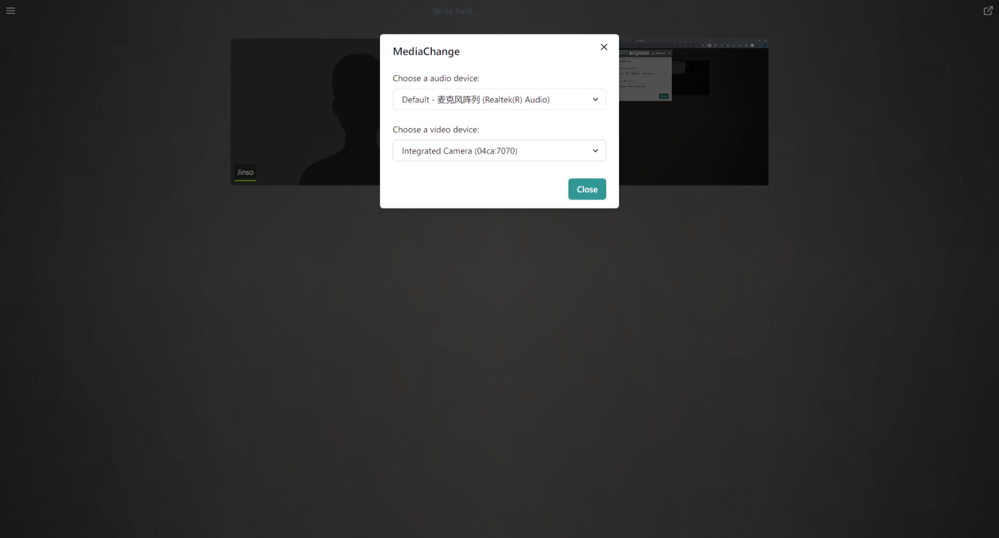
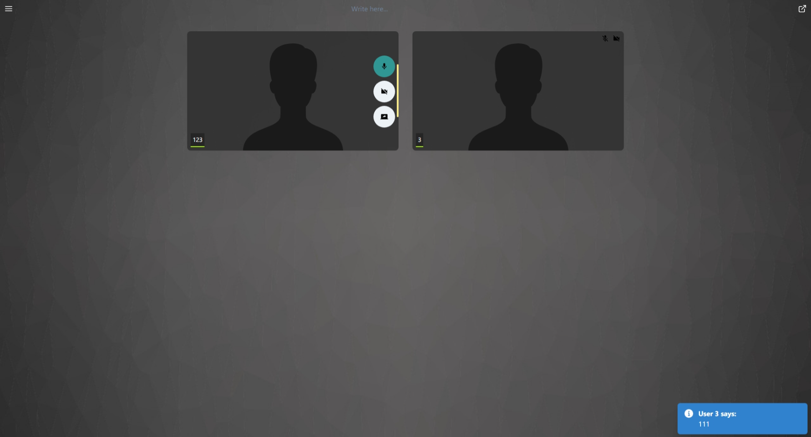

# TurboMeet

一个基于 WebRTC 实现的视频会议的全栈开发项目，支持音频，视频，共享屏幕，消息发送的方式来进行交互。同时项目是基于TypeScript的全栈开发，并使用 pnpm monorepo 进行项目管理

## 技术栈

客户端

- NextJS
- ReactJS
- Tailwind CSS
- Chakra UI
- Zustand

服务器端

- Fastify
- Socket.io
- Mediasoup

## 功能

### 登录界面

可以按自己的喜好去选择音视频

### 会议房间

本地

- 控制音视频的开关
- 共享屏幕
- 音频可视化
- 自定义切换音视频设备

远程

- 查看音视频是否打开
- 音频可视化

简易的消息通信

## 项目启动

首先拉取[源代码](https://github.com/JinSooo/turbomeet)，完成后，进入目录并执行

```bash
pnpm install
``````

再分别进入`client` 和 `server` 先配置 `config.ts` 中的ip（可以设置成内网ip，127.0.0.1因为一些原因在服务器端无法使用）

```typescript
// client/config.ts
const config = {
  // 修改为你的内网ip
  socketIp: 'https://ip:8080/',
}
```

```typescript
// server/config.ts
const config = {
  // ...
  mediasoup: {
    // ...
    webRtcTransport: {
      listenIps: [
        {
          // 修改为你的内网ip
          ip: 'ip',
        },
      ],
    },
 },
}

export default config

```

再分别执行

```bash
# client
pnpm dev
# 注意，WebRTC只能在 localhost 或 具有https的网站 中执行
pnpm https

# server
pnpm dev
```

运行后，服务器端地址: `https://ip:8080`，客户端地址: `https://ip:3001`，就可以访问了

### 打包运行

如果想要进行打包的话，可以分别进入`client` 和 `server`执行

```bash
# client
pnpm build
pnpm start

# server
pnpm build
pnpm start
```

## mediasoup 的简单介绍

Mediasoup 是推出时间不长的 WebRTC 流媒体服务器开源库，其地址为：
[Mediasoup](https://github.com/versatica/mediasoup)

由应用层和数据处理层组成。应用层是通过 Node.js 实现的；数据处理层由 C++ 语言实现，包括 DTLS 协议实现、ICE 协议实现、SRTP/SRTCP 协议实现、路由转发等。

### 架构



Mediasoup 把每个实例称为一个 Worker，在 Worker 内部有多个 Router，每个 Router 相当于一个房间。在每个房间里可以有多个用户或称为参与人，每个参与人在 Mediasoup 中由一个 Transport 代理。换句话说，对于房间（Router）来说，Transport 就相当于一个用户。

更加详细的使用可以去看看我写的一篇[文章](https://jinso.top/article/streaming-mediasoup-use)

## 页面展示

### 登录界面



### 会议房间

桌面端



移动端



屏幕共享



自定义音视频设备



消息发送


